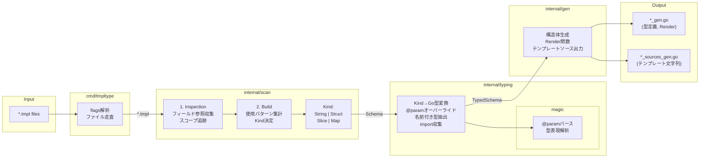

# CLAUDE.md

This file provides guidance to Claude Code (claude.ai/code) when working with code in this repository.

## Project Overview

tmpltype is a Go code generator that creates type-safe template rendering functions from Go template files. It analyzes `.tmpl` files and generates Go structs and render functions, enabling compile-time type safety for template parameters.

## Build and Test Commands

```bash
# Run all tests
go test ./...

# Run a specific test
go test ./internal/gen -run TestEmit_BasicScaffoldAndTypes

# Build the CLI
go build ./cmd/tmpltype

# Install the CLI
go install ./cmd/tmpltype

# Run code generation in examples
cd examples/01_basic && go generate && go run .
```

## Architecture



The code generation pipeline flows through four internal packages:

1. **cmd/tmpltype** - CLI entry point
   - Parses flags (`-dir`, `-pkg`, `-out`)
   - Scans template files (supports flat `dir/*.tmpl` and grouped `dir/*/*.tmpl`)
   - Invokes the generation pipeline

2. **internal/scan** - Template AST analysis (two-pass architecture)
   - **Inspection phase** (`inspection.go`): Walks template AST to collect field references with usage types
     - Tracks dot (`.`) scope through `with`, `range`, `if` blocks
     - Records usage patterns (Leaf, Range, RangeMap, Index, Scope) without making type decisions
     - Handles unknown custom functions by dynamically adding dummies during parse
   - **Build phase** (`build.go`): Constructs schema from collected references
     - Aggregates usage patterns and determines child relationships
     - Decides Kind based on complete information: Map > Slice > Struct > String
     - No promotion/replacement logic needed (all info available upfront)

3. **internal/typing** - Type resolution
   - Applies default type inference from scan results
   - Processes `@param` directive overrides (via `internal/typing/magic`)
   - Extracts named types for struct generation
   - Collects required imports (e.g., `time` for `time.Time`)

4. **internal/gen** - Code emission
   - Generates two output files:
     - Main file: type definitions, `InitTemplates()`, `Render*()` functions
     - Sources file: template string literals
   - Supports template grouping (subdirectories become nested namespaces)
   - Uses functional options pattern (`WithFuncs`) for custom template functions

## Key Patterns

- **@param directive**: Use `{{/* @param Path.To.Field type */}}` in templates to override inferred types
- **Template grouping**: Templates in `templates/email/*.tmpl` generate `Template.Email.Welcome` style namespaces
- **Generated files**: Output includes `*_gen.go` (types/functions) and `*_sources_gen.go` (template strings)
